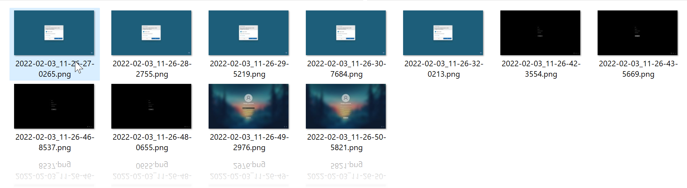

# PowerRemoteDesktop WinLogon (LogonUI) Plugin (Work In Progress)

This Application is expected to be an extension of the PowerRemoteDesktop Server PowerShell Application.

It allows to interact with active terminal session WinLogon (LogonUI) isolated desktop from default desktop.

You can for example capture snapshot of:

* UAC Prompt
* Logon
* CTRL+ALT+DEL Panel

You can also interact with keyboard and mouse in this isolated desktop (WIP).

## Work In Progress

I'm coding this plugin in parallel of PowerRemoteDesktop. This plugin is in its very early stage and is not yet even finished.

Actually it only demonstrate that you can capture images of WinLogon isolated desktop from default desktop.

I will continue to work on this plugin as soon as I finished the PowerRemoteDesktop v2.1 with Motion Update (My priority).

## How it Works

As always, I'm really phobic of external dependencies / tools.

The application must be run as user `NT AUTHORITY\SYSTEM`, to do so, through PowerShell, I'm creating a new `SYSTEM` task and run this task immediately (no need of psexec or custom Windows service).

At this point, the issue is that Task Scheduler run the new task in **Terminal Session Id** `0` which doesn't have access to our active Terminal Session Desktops.

To overcome this problem, when task is run in Session `0`, I'm scanning available Terminal Sessions for the **Active One** (Ex: Physical or RDP), when found I re-spawn current process in the correct Terminal Session.

At this moment, we have our application running as `NT AUTHORITY\SYSTEM` in our current Terminal Session default Desktop. We can now legitimately switch from current default Desktop to WinLogon desktop (`WinSta0\winlogon`).

We are now attached to **WinLogon** desktop and can interract with it (I/O).

To detect when WinLogon desktop is spawned (UAC Prompt, Logon etc..) we simply need to check if a Winlogon Desktop Window is currently in Foreground. We don't need to monitor for Windows Message (I really like to simplify things).

Now we need to transfer events from both default and winlogon desktop. To do so I'm simply using Named Pipe.

You will find in current project a PowerShell Script that demonstrate how to:

* Install and Run the Plugin.
* Catch Winlogon Desktop Snapshots from default desktop and through Named Pipe.
* Uninstall the Plugin.

Thats it!

### How to test it

First you need to compile the C# application using Visual Studio (In my case VS 2019)

Then, you must open a new PowerShell Terminal as Administrator (Important) and `cd` to the root project directory.

⚠️ It is crutial to be located in project root directory since I'm using relative paths to simplify the testing process.

Example: `cd Desktop\PowerRemoteDesktop_LogonUI`

You can now launch the script using:

(PS `PowerRemoteDesktop_LogonUI`) > `IEX(Get-Content .\LogonUI_PluginTester.ps1 -RAW)`

It should monitor for WinLogon Events...

Open for example `regedit.exe`, wait few seconds then press `CTRL+ALT+DEL` and go to **Update Password** panel.

Check in the new folder (in root directory) called `LogonUI_Snapshots` for WinLogon Desktop images.

